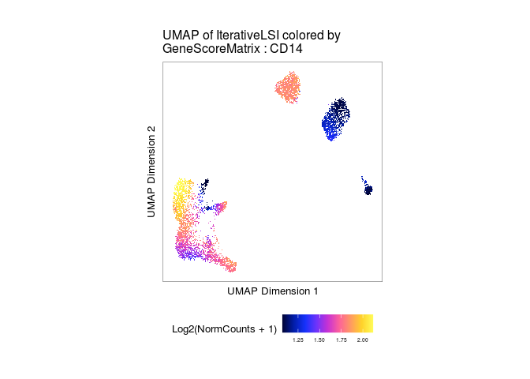
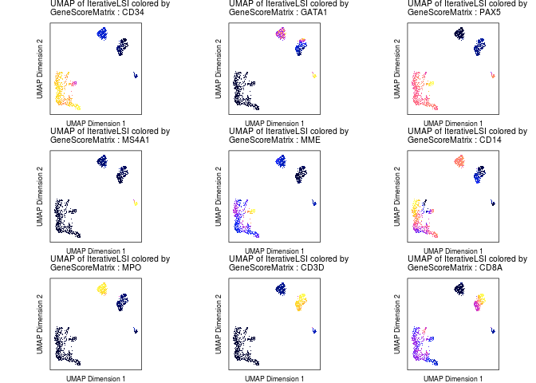

---
output:
  pdf_document: default
  html_document: default
---
scATAC Tutorial
================

``` r
#set threads specific to your machine
addArchRThreads(threads = 35) 
```

We need a reference genome for downstream analyses. ArchR natively
supports hg19, hg38, mm9, and mm10.

``` r
inputFiles <- getTutorialData(tutorial = "Hematopoiesis")
inputFiles
```

    ##                                       scATAC_BMMC_R1 
    ##      "HemeFragments/scATAC_BMMC_R1.fragments.tsv.gz" 
    ##                                  scATAC_CD34_BMMC_R1 
    ## "HemeFragments/scATAC_CD34_BMMC_R1.fragments.tsv.gz" 
    ##                                       scATAC_PBMC_R1 
    ##      "HemeFragments/scATAC_PBMC_R1.fragments.tsv.gz"

``` r
addArchRGenome(genome = "hg19", install = FALSE)
```

    ## Setting default genome to Hg19.

### Creating Arrow Files

ArchR uses arrow files, the base unit of an ArchR analytical project.
Every arrow file stores all the data associated with an individual
sample (i.e. a single replicate of a particular condition). During
creation and as additional analyses are performed, ArchR updates and
edits each Arrow file to contain additional layers of information. IAn
Arrow file is actually just a path to an external file stored on disk.
More explicitly, an Arrow file is not an R-language object that is
stored in memory but rather an HDF5-format file stored on disk.

``` r
ArrowFiles <- createArrowFiles(
  inputFiles = inputFiles,
  sampleNames = names(inputFiles),
  minTSS = 4, #Dont set this too high because you can always increase later
  minFrags = 1000, 
  addTileMat = TRUE,
  addGeneScoreMat = TRUE
)
#We can inspect the ArrowFiles object to see that it is actually just a character vector of Arrow file paths.
ArrowFiles
```

    ## [1] "scATAC_PBMC_R1.arrow"      "scATAC_CD34_BMMC_R1.arrow"

Quality Control of scATAC-seq data is essential to remove cells that
contribute to low-quality data. There are three characteristics that
scATAC considers 1. The number of unique nuclear fragments (i.e. not
mapping to mitochondrial DNA). 2. The signal-to-background ratio. Low
signal-to-background ratio is often attributed to dead or dying cells
which have de-chromatinzed DNA which allows for random transposition
genome-wide. 3. The fragment size distribution. Due to nucleosomal
periodicity, we expect to see depletion of fragments that are the length
of DNA wrapped around a nucleosome (approximately 147 bp).

ArchR also infers doublets, a single droplet that contains multiple
cells.

``` r
doubScores <- addDoubletScores(
  input = ArrowFiles,
  k = 10, #Refers to how many cells near a "pseudo-doublet" to count.
  knnMethod = "UMAP", #Refers to the embedding to use for nearest neighbor search.
  LSIMethod = 1
)
```

### Creating an ArchRProject

``` r
proj <- ArchRProject(
  ArrowFiles = ArrowFiles, 
  outputDirectory = "HemeTutorial",
  copyArrows = TRUE #This is recommened so that you maintain an unaltered copy for later usage.
)
```

``` r
#We can query which data matrices are available in the ArchRProject. At this point in time, we should have “GeneScoreMatrix” and “TileMatrix”. As we continue to work and add to the ArchRProject, we can use the following function to query which matricies are added to the project.
getAvailableMatrices(proj)
```

    ## [1] "GeneScoreMatrix" "TileMatrix"

``` r
#Next we can filter out putative doublets based on the scores established in the `infer doublets` chunk. Importantly, this does not delete the data from the Arrow files, but rather forces ArchRProject to ignore these cells. 
proj <- filterDoublets(ArchRProj = proj)
```

### Dimensionality Reduction and Clustering

``` r
#ArchR implements an iterative LSI dimensionality reduction via the addIterativeLSI() function.
proj <- addIterativeLSI(ArchRProj = proj, useMatrix = "TileMatrix", name = "IterativeLSI")

#To call clusters in this reduced dimension sub-space, we use the addClusters() function which uses Seurat’s graph clustering as the default clustering method.
proj <- addClusters(input = proj, reducedDims = "IterativeLSI")
```

    ## Modularity Optimizer version 1.3.0 by Ludo Waltman and Nees Jan van Eck
    ## 
    ## Number of nodes: 5132
    ## Number of edges: 310127
    ## 
    ## Running Louvain algorithm...
    ## Maximum modularity in 10 random starts: 0.8165
    ## Number of communities: 9
    ## Elapsed time: 0 seconds

``` r
#We can visualize our scATAC-seq data using a 2-dimensional representation such as Uniform Manifold Approximation and Projection (UMAP). To do this, we add a UMAP embedding to our ArchRProject object with the addUMAP() function. This function uses the uwot package to perform UMAP.
proj <- addUMAP(ArchRProj = proj, reducedDims = "IterativeLSI")
```

``` r
#We can visualize the UMAP in a number of ways by calling various attributes of the cells stored in the `cellColData` matrix. Here, we can visualize the UMAP by sample, or clusters.
p1 <- plotEmbedding(ArchRProj = proj, colorBy = "cellColData", name = "Sample", embedding = "UMAP")
```

    ## ArchR logging to : ArchRLogs/ArchR-plotEmbedding-9af566fc8ef3-Date-2021-05-05_Time-16-47-21.log
    ## If there is an issue, please report to github with logFile!

    ## Getting UMAP Embedding

    ## ColorBy = cellColData

    ## Plotting Embedding

    ## 1 
    ## ArchR logging successful to : ArchRLogs/ArchR-plotEmbedding-9af566fc8ef3-Date-2021-05-05_Time-16-47-21.log

``` r
p2 <- plotEmbedding(ArchRProj = proj, colorBy = "cellColData", name = "Clusters", embedding = "UMAP")
```

    ## ArchR logging to : ArchRLogs/ArchR-plotEmbedding-9af53110edc5-Date-2021-05-05_Time-16-47-21.log
    ## If there is an issue, please report to github with logFile!
    ## Getting UMAP Embedding
    ## ColorBy = cellColData
    ## Plotting Embedding
    ## 1 
    ## ArchR logging successful to : ArchRLogs/ArchR-plotEmbedding-9af53110edc5-Date-2021-05-05_Time-16-47-21.log

``` r
ggAlignPlots(p1, p2, type = "h")
```

<!-- -->

``` r
#To save an editable vectorized version of this plot, we use the plotPDF() function.
plotPDF(p1,p2, name = "Plot-UMAP-Sample-Clusters.pdf",
        ArchRProj = proj, addDOC = FALSE, width = 5, height = 5)
```

### Assigning Clusters with Gene Scores

The novelty of single cell approaches is to be able to resolve cellular
heterogeneity in complex tissues. We can identify cells population by
assigning cell-type specific markers to them.

``` r
#First, we add imputation weights using MAGIC **read up on MAGIC** to help smooth the dropout noise in our gene scores
proj <- addImputeWeights(proj)

#Now we can overlay our marker gene scores on our 2D UMAP embedding.
markerGenes  <- c(
    "CD34",  #Early Progenitor
    "GATA1", #Erythroid
    "PAX5", "MS4A1", "MME", #B-Cell Trajectory
    "CD14", "MPO", #Monocytes
    "CD3D", "CD8A"#TCells
  )
```

``` r
p <- plotEmbedding(
    ArchRProj = proj, 
    colorBy = "GeneScoreMatrix", 
    name = markerGenes, 
    embedding = "UMAP",
    imputeWeights = getImputeWeights(proj)
)
```

``` r
#To plot a specific gene we can subset this plot list using the gene name.
p$CD14
```

<!-- -->

``` r
#Plot all genes defined in markerGenes
p2 <- lapply(p, function(x){
    x + guides(color = FALSE, fill = FALSE) + 
    theme_ArchR(baseSize = 6.5) +
    theme(plot.margin = unit(c(0, 0, 0, 0), "cm")) +
    theme(
        axis.text.x=element_blank(), 
        axis.ticks.x=element_blank(), 
        axis.text.y=element_blank(), 
        axis.ticks.y=element_blank()
    )
})
do.call(cowplot::plot_grid, c(list(ncol = 3),p2))
```

<!-- -->

``` r
#Save an editable PDF version
plotPDF(plotList = p, 
    name = "Plot-UMAP-Marker-Genes-W-Imputation.pdf", 
    ArchRProj = proj, 
    addDOC = FALSE, width = 5, height = 5)
```
